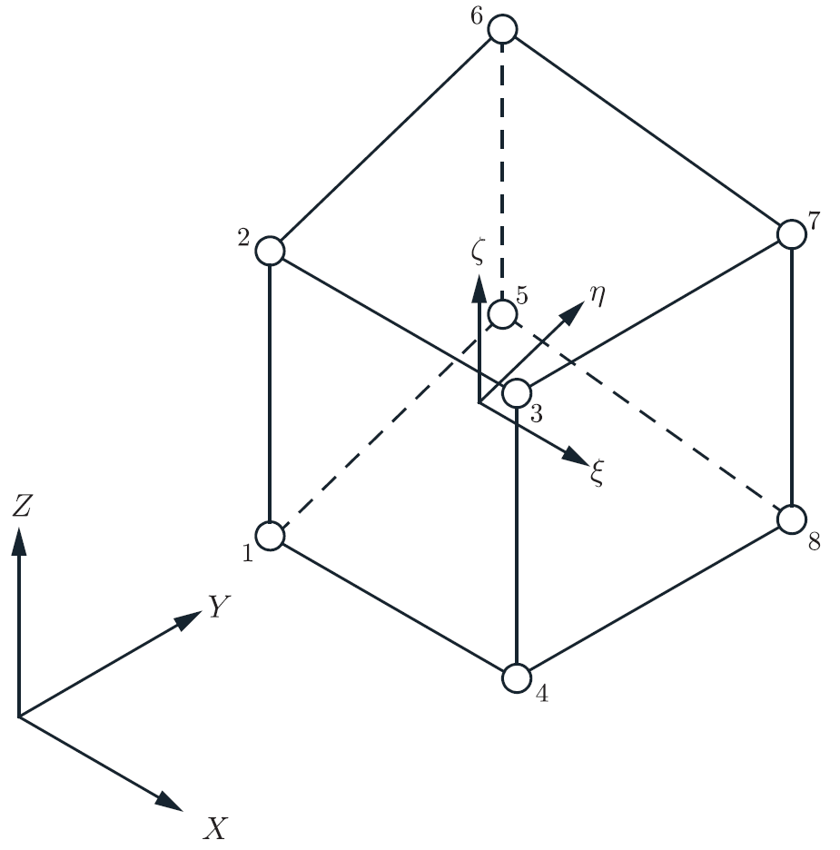

# FESoftware
An open-source Finite Element Analysis software that is written in C#.

Work in progress.

# Linear 8-Noded Hexahedral Finite Element
A geometrically and material linear 8-noded hexahedral FE algorithm.
Currently only allow 8 Gaussian scheme to be used.
When creating the element, the nodes have to be selected in the order shown in the Figure below.

  

